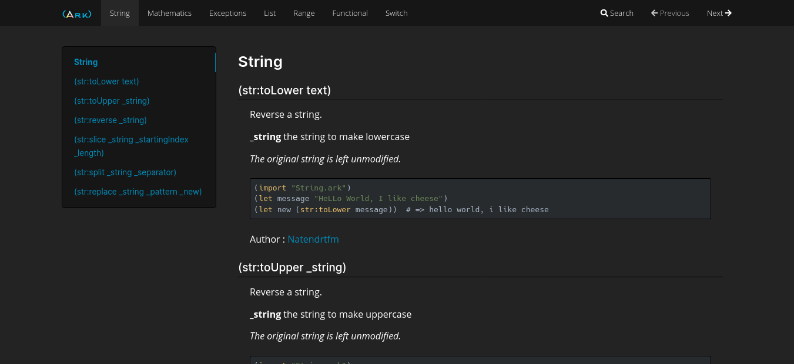

# ArkDoc

It's a **Lite** documentation generator for arkscript based on Mkdocs, and written in ruby.


## Dependencies

* Python >= 2.7 (Python 3.7 tested and working)
* Ruby >= 2.5

## Usage

```bash
# Clone repository
~$ git clone https://github.com/ArkScript-lang/ArkDoc.git
# The documentation will be generated in this folder
~/ArkDoc$ mkdir docs
# Put your arkscripts in this folder (default source directory)
# you can change it with -S option
~/ArkDoc$ mkdir ark
# Install Mkdocs
~$ pip install mkdocs
# Print help
~/ArkDoc$ ruby start.rb -H
# Build site in docs/[SITE_NAME]/site with default source directory
# for names with spaces, use this syntax : "Name of Site"
~/ArkDoc$ ruby start.rb gen [SITE_NAME]
```
You cans find syntax .

## Example
```clojure
###
# @brief Reverse a string.
# @param _string the string to reverse
# @details The original string is left unmodified.
# =begin
# (import "String.ark")
# (let message "hello world, I like goats")
# (let reversed (str:reverse message))  # => staog ekil I ,dlrow olleh
# =end
# @author https://github.com/Natendrtfm
##
(let str:reverse (fun (_string) {
    (mut _index (- (len _string) 1))
    (mut _returnedString "")
    (while (> _index -1) {
        (set _returnedString (+ _returnedString (@ _string _index)))
        (set _index (- _index 1))
    })
    _returnedString
}))
```

